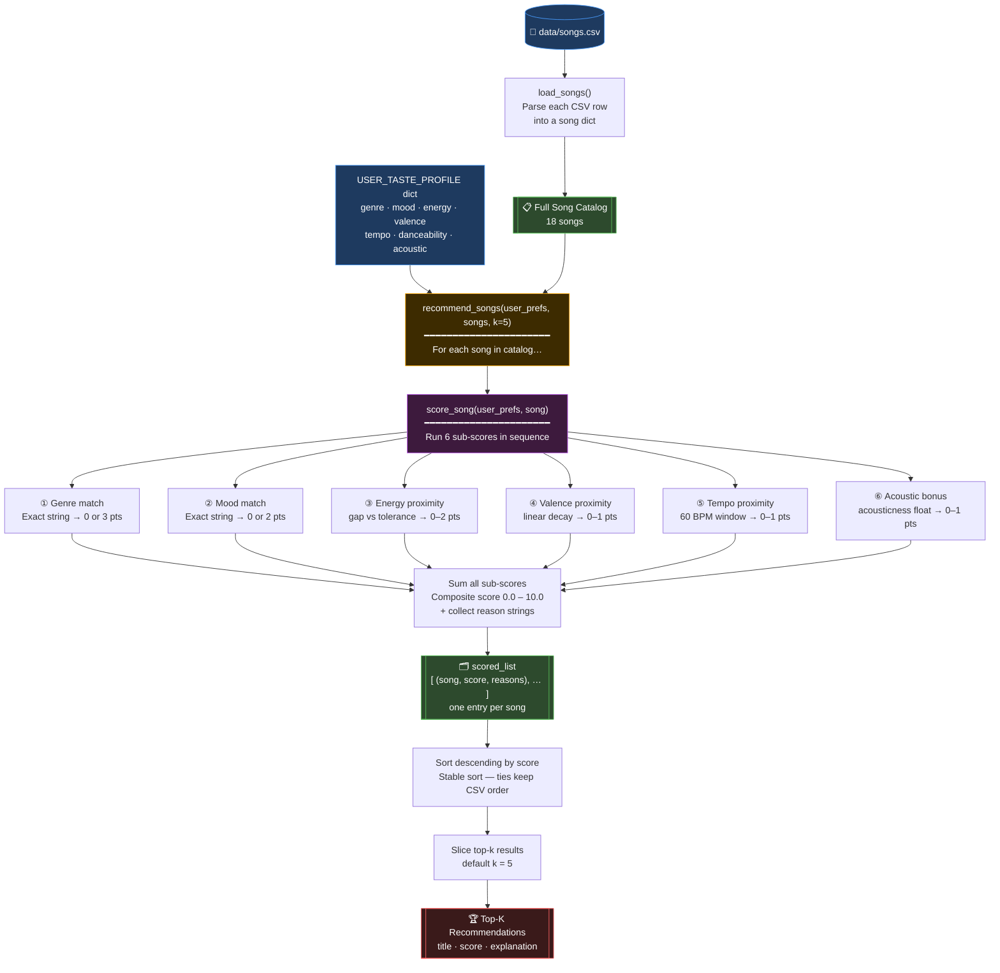

# 🎵 Music Recommender Simulation

## Project Summary

In this project you will build and explain a small music recommender system.

Your goal is to:

- Represent songs and a user "taste profile" as data
- Design a scoring rule that turns that data into recommendations
- Evaluate what your system gets right and wrong
- Reflect on how this mirrors real world AI recommenders

Replace this paragraph with your own summary of what your version does.

---

## How The System Works

Real-world music recommenders like Spotify or YouTube Music build a model of your taste by analyzing everything you listen to — how long you play a track, whether you skip it, what you replay — and then find patterns across millions of users to surface songs you have never heard but are likely to enjoy. They combine collaborative filtering (people like you also liked this) with content-based signals (this song sounds like ones you already love). This simulation focuses entirely on the content-based side: it compares each song's measurable attributes against a user's stated taste profile and assigns a composite score, then returns the top matches. Rather than learning from implicit listening behavior, it prioritizes explicit signals — genre alignment, mood match, energy proximity, and acoustic character — to produce ranked recommendations with plain-language explanations.

---

### Features

**Song object fields:**

| Field | Type | What it captures |
|---|---|---|
| `genre` | string | Broad musical category (e.g., r&b, rock, lofi) |
| `mood` | string | Emotional tone of the track (e.g., sad, happy, intense) |
| `energy` | float 0–1 | How driving or forceful the song feels |
| `tempo_bpm` | float | Beats per minute — the pace of the track |
| `valence` | float 0–1 | Musical positivity; high = upbeat, low = somber |
| `danceability` | float 0–1 | How suited the track is for dancing |
| `acousticness` | float 0–1 | How acoustic vs. electronic the production is |

**UserProfile / taste profile fields:**

| Field | Type | What it captures |
|---|---|---|
| `favorite_genre` | string | The genre the user most wants to hear right now |
| `favorite_mood` | string | The mood the user is currently in |
| `target_energy` | float 0–1 | The energy level the user is looking for |
| `target_valence` | float 0–1 | How emotionally positive or somber the user wants to feel |
| `target_tempo_bpm` | float | The ideal BPM for the listening session |
| `target_danceability` | float 0–1 | How groovy or danceable the user wants songs to be |
| `likes_acoustic` | bool | Whether the user prefers acoustic-leaning production |
| `energy_tolerance` | float | How far the actual energy may stray before losing points |

---

### Algorithm Recipe

Every song in the catalog is scored by calling `score_song(user_prefs, song)`, which produces a **composite score between 0.0 and 10.0** from six independent sub-scores. All 18 songs are scored in one pass, sorted highest-to-lowest, and the top-k are returned as recommendations.

#### Data flow



**Reading the diagram:**
- **Blue** — the two inputs: `songs.csv` and `USER_TASTE_PROFILE`
- **Orange** — the outer loop in `recommend_songs()` that visits every song once
- **Purple** — `score_song()`, which runs the six sub-score rules for that one song
- **Green** — intermediate collections that grow during the loop
- **Red** — the final ranked output printed to the terminal

#### Sub-scores and weights

| # | Signal | Max pts | Rule |
|---|--------|---------|------|
| 1 | **Genre match** | 3.0 | Exact string match with `favorite_genre` → **3.0 pts**; no match → **0 pts** |
| 2 | **Mood match** | 2.0 | Exact string match with `favorite_mood` → **2.0 pts**; no match → **0 pts** |
| 3 | **Energy proximity** | 2.0 | `gap = │song.energy − target_energy│`; gap ≤ tolerance → **2.0 pts**; otherwise `2 × (1 − gap)`, floored at 0 |
| 4 | **Valence proximity** | 1.0 | `gap = │song.valence − target_valence│`; pts = `1.0 × (1 − gap)` linear decay |
| 5 | **Tempo proximity** | 1.0 | `gap = │song.tempo_bpm − target_tempo_bpm│`; normalised over 60 BPM window; pts = `1.0 × (1 − min(gap/60, 1.0))` |
| 6 | **Acoustic bonus** | 1.0 | Only when `likes_acoustic = True`: pts = `song.acousticness`; otherwise 0 |

**Total maximum score = 3 + 2 + 2 + 1 + 1 + 1 = 10.0**

Genre and mood carry the most weight because they are the clearest, most decisive signals of what a listener wants in the moment. Energy uses a tolerance band so small deviations don't unfairly sink a good match. Valence, tempo, and acousticness add nuance but can never override a strong genre and mood alignment.

#### Worked examples (profile: r&b / sad / energy 0.50 / valence 0.35 / tempo 85 / likes acoustic)

**"Broken Clocks"** — r&b, sad, energy 0.48, valence 0.31, tempo 85, acousticness 0.55
```
Genre    3.00  ✅ r&b matches
Mood     2.00  ✅ sad matches
Energy   2.00  ✅ gap 0.02 is within tolerance
Valence  0.96  gap 0.04 → 1 × (1 − 0.04)
Tempo    1.00  gap 0 BPM → full points
Acoustic 0.55  acousticness passthrough
──────────────
Total    9.51  → top of the list
```

**"Storm Runner"** — rock, intense, energy 0.91, valence 0.48, tempo 152, acousticness 0.10
```
Genre    0.00  ✗ rock ≠ r&b
Mood     0.00  ✗ intense ≠ sad
Energy   1.18  gap 0.41 > tolerance → 2 × (1 − 0.41)
Valence  0.87  gap 0.13 → 1 × (1 − 0.13)
Tempo    0.00  gap 67 BPM → normalised to 1.0 → 0 pts
Acoustic 0.10  acousticness passthrough
──────────────
Total    2.15  → near the bottom
```

#### Ranking and selection

1. `score_song()` is called once per song → returns `(score, [reason strings])`
2. `recommend_songs()` sorts all `(song, score)` pairs descending by score
3. The top-k entries are sliced out; ties keep their original CSV order (stable sort)
4. Each result prints with plain-English reasons, e.g. *"Matches your favorite genre (r&b)"*

---

### Expected Biases

This system has several predictable biases built directly into its design. Being aware of them upfront is part of understanding how even simple AI systems can be unfair or limited:

- **Genre over-prioritization.** Genre alone is worth 3 out of 10 possible points — the single largest sub-score. This means a perfect-mood, perfect-energy song in the wrong genre will always lose to a mediocre song whose genre label happens to match. A folk song and an r&b song can feel nearly identical to a listener, but this system treats them as completely unrelated.

- **Mood is all-or-nothing.** The mood sub-score is a binary exact match. A song tagged `"melancholic"` earns zero credit when the user's profile says `"sad"`, even though those moods are nearly synonymous. Any catalog with nuanced mood labels will be unfairly penalised.

- **Acoustic bias is one-directional.** The acoustic bonus only rewards high `acousticness` when `likes_acoustic = True`. There is no equivalent penalty or bonus for users who actively prefer electronic production. A user who dislikes acoustic music gets no signal from this dimension at all.

- **Catalog representation bias.** The system can only recommend songs that already exist in `songs.csv`. If the catalog over-represents certain genres or moods, those genres will dominate recommendations regardless of score logic. A user whose taste falls outside the catalog's coverage gets poor results no matter how well the scoring works.

- **No diversity enforcement.** The ranking is purely by score descending. If five very similar songs all score 9+, they all get recommended, and the user receives a list with no variety. A real recommender would balance similarity with diversity to keep suggestions interesting.

---

## Sample Terminal Output

Running `python -m src.main` from the project root produces the following output.
Two profiles are shown back-to-back: the default **pop / happy** verification profile and the primary **r&b / sad** profile.

```
Catalog loaded: 18 songs

============================================================
  Music Recommender  --  Top 5 picks
============================================================
  Genre   : pop         Mood    : happy
  Energy  : 0.80          Valence : 0.80
  Tempo   : 120 BPM       Acoustic: No
============================================================

  #1  Sunrise City
       Artist : Neon Echo
       Genre  : pop  |  Mood : happy
       Score  : 8.93 / 10.0  [#########.]
       Reasons:
         + genre match (+3.0)
         + mood match (+2.0)
         + energy 0.82 vs target 0.80 (gap 0.02) (+2.00)
         + valence 0.84 vs target 0.80 (gap 0.04) (+0.96)
         + tempo 118 BPM vs target 120 BPM (gap 2) (+0.97)
         + acoustic bonus skipped (likes_acoustic=False) (+0.0)
  ------------------------------------------------------------
  #2  Gym Hero
       Artist : Max Pulse
       Genre  : pop  |  Mood : intense
       Score  : 6.77 / 10.0  [#######...]
       Reasons:
         + genre match (+3.0)
         + mood mismatch: 'intense' vs 'happy' (+0.0)
         + energy 0.93 vs target 0.80 (gap 0.13) (+2.00)
         + valence 0.77 vs target 0.80 (gap 0.03) (+0.97)
         + tempo 132 BPM vs target 120 BPM (gap 12) (+0.80)
         + acoustic bonus skipped (likes_acoustic=False) (+0.0)
  ------------------------------------------------------------
  #3  Rooftop Lights
       Artist : Indigo Parade
       Genre  : indie pop  |  Mood : happy
       Score  : 5.92 / 10.0  [######....]
       Reasons:
         + genre mismatch: 'indie pop' vs 'pop' (+0.0)
         + mood match (+2.0)
         + energy 0.76 vs target 0.80 (gap 0.04) (+2.00)
         + valence 0.81 vs target 0.80 (gap 0.01) (+0.99)
         + tempo 124 BPM vs target 120 BPM (gap 4) (+0.93)
         + acoustic bonus skipped (likes_acoustic=False) (+0.0)
  ------------------------------------------------------------
  #4  Carnival Lights
       Artist : Rumba Kings
       Genre  : latin  |  Mood : euphoric
       Score  : 3.63 / 10.0  [####......]
       Reasons:
         + genre mismatch: 'latin' vs 'pop' (+0.0)
         + mood mismatch: 'euphoric' vs 'happy' (+0.0)
         + energy 0.88 vs target 0.80 (gap 0.08) (+2.00)
         + valence 0.92 vs target 0.80 (gap 0.12) (+0.88)
         + tempo 105 BPM vs target 120 BPM (gap 15) (+0.75)
         + acoustic bonus skipped (likes_acoustic=False) (+0.0)
  ------------------------------------------------------------
  #5  City Grid
       Artist : 404 Collective
       Genre  : electronic  |  Mood : energetic
       Score  : 3.53 / 10.0  [####......]
       Reasons:
         + genre mismatch: 'electronic' vs 'pop' (+0.0)
         + mood mismatch: 'energetic' vs 'happy' (+0.0)
         + energy 0.90 vs target 0.80 (gap 0.10) (+2.00)
         + valence 0.66 vs target 0.80 (gap 0.14) (+0.86)
         + tempo 140 BPM vs target 120 BPM (gap 20) (+0.67)
         + acoustic bonus skipped (likes_acoustic=False) (+0.0)
  ------------------------------------------------------------

============================================================
  Music Recommender  --  Top 5 picks
============================================================
  Genre   : r&b         Mood    : sad
  Energy  : 0.50          Valence : 0.35
  Tempo   : 85 BPM       Acoustic: Yes
============================================================

  #1  Broken Clocks
       Artist : Mira Solano
       Genre  : r&b  |  Mood : sad
       Score  : 9.51 / 10.0  [##########]
       Reasons:
         + genre match (+3.0)
         + mood match (+2.0)
         + energy 0.48 vs target 0.50 (gap 0.02) (+2.00)
         + valence 0.31 vs target 0.35 (gap 0.04) (+0.96)
         + tempo 85 BPM vs target 85 BPM (gap 0) (+1.00)
         + acoustic feel 0.55 (you like acoustic) (+0.55)
  ------------------------------------------------------------
  #2  Dust and Bones
       Artist : Prairie Wind
       Genre  : folk  |  Mood : melancholic
       Score  : 4.75 / 10.0  [#####.....]
       Reasons:
         + genre mismatch: 'folk' vs 'r&b' (+0.0)
         + mood mismatch: 'melancholic' vs 'sad' (+0.0)
         + energy 0.33 vs target 0.50 (gap 0.17) (+2.00)
         + valence 0.38 vs target 0.35 (gap 0.03) (+0.97)
         + tempo 76 BPM vs target 85 BPM (gap 9) (+0.85)
         + acoustic feel 0.93 (you like acoustic) (+0.93)
  ------------------------------------------------------------
  #3  Focus Flow
       Artist : LoRoom
       Genre  : lofi  |  Mood : focused
       Score  : 4.46 / 10.0  [####......]
       Reasons:
         + genre mismatch: 'lofi' vs 'r&b' (+0.0)
         + mood mismatch: 'focused' vs 'sad' (+0.0)
         + energy 0.40 vs target 0.50 (gap 0.10) (+2.00)
         + valence 0.59 vs target 0.35 (gap 0.24) (+0.76)
         + tempo 80 BPM vs target 85 BPM (gap 5) (+0.92)
         + acoustic feel 0.78 (you like acoustic) (+0.78)
  ------------------------------------------------------------
  #4  Coffee Shop Stories
       Artist : Slow Stereo
       Genre  : jazz  |  Mood : relaxed
       Score  : 4.45 / 10.0  [####......]
       Reasons:
         + genre mismatch: 'jazz' vs 'r&b' (+0.0)
         + mood mismatch: 'relaxed' vs 'sad' (+0.0)
         + energy 0.37 vs target 0.50 (gap 0.13) (+2.00)
         + valence 0.71 vs target 0.35 (gap 0.36) (+0.64)
         + tempo 90 BPM vs target 85 BPM (gap 5) (+0.92)
         + acoustic feel 0.89 (you like acoustic) (+0.89)
  ------------------------------------------------------------
  #5  Library Rain
       Artist : Paper Lanterns
       Genre  : lofi  |  Mood : chill
       Score  : 4.39 / 10.0  [####......]
       Reasons:
         + genre mismatch: 'lofi' vs 'r&b' (+0.0)
         + mood mismatch: 'chill' vs 'sad' (+0.0)
         + energy 0.35 vs target 0.50 (gap 0.15) (+2.00)
         + valence 0.60 vs target 0.35 (gap 0.25) (+0.75)
         + tempo 72 BPM vs target 85 BPM (gap 13) (+0.78)
         + acoustic feel 0.86 (you like acoustic) (+0.86)
  ------------------------------------------------------------
```

**Verification notes — pop / happy profile:**
- `#1 Sunrise City` hits both genre (`pop`) and mood (`happy`) for +5.0 pts, and its energy/valence/tempo are all within a tiny gap of the target — score 8.93 ✅
- `#2 Gym Hero` wins the genre match (+3.0) but loses the mood (`intense` ≠ `happy`) — it drops to 6.77, correctly ranked below Sunrise City ✅
- `#3 Rooftop Lights` wins the mood (`happy`) but loses the genre (`indie pop` ≠ `pop`) — 5.92, confirming genre outweighs mood as designed ✅
- `#4` and `#5` miss both genre and mood, surviving only on numeric proximity — correctly at the bottom ✅

---

## Getting Started

### Setup

1. Create a virtual environment (optional but recommended):

   ```bash
   python -m venv .venv
   source .venv/bin/activate      # Mac or Linux
   .venv\Scripts\activate         # Windows

2. Install dependencies

```bash
pip install -r requirements.txt
```

3. Run the app:

```bash
python -m src.main
```

### Running Tests

Run the starter tests with:

```bash
pytest
```

You can add more tests in `tests/test_recommender.py`.

---

## Experiments You Tried

Use this section to document the experiments you ran. For example:

- What happened when you changed the weight on genre from 2.0 to 0.5
- What happened when you added tempo or valence to the score
- How did your system behave for different types of users

---

## Limitations and Risks

Summarize some limitations of your recommender.

Examples:

- It only works on a tiny catalog
- It does not understand lyrics or language
- It might over favor one genre or mood

You will go deeper on this in your model card.

---

## Reflection

Read and complete `model_card.md`:

[**Model Card**](model_card.md)

Write 1 to 2 paragraphs here about what you learned:

- about how recommenders turn data into predictions
- about where bias or unfairness could show up in systems like this


---

## 7. `model_card_template.md`

Combines reflection and model card framing from the Module 3 guidance. :contentReference[oaicite:2]{index=2}  

```markdown
# 🎧 Model Card - Music Recommender Simulation

## 1. Model Name

Give your recommender a name, for example:

> VibeFinder 1.0

---

## 2. Intended Use

- What is this system trying to do
- Who is it for

Example:

> This model suggests 3 to 5 songs from a small catalog based on a user's preferred genre, mood, and energy level. It is for classroom exploration only, not for real users.

---

## 3. How It Works (Short Explanation)

Describe your scoring logic in plain language.

- What features of each song does it consider
- What information about the user does it use
- How does it turn those into a number

Try to avoid code in this section, treat it like an explanation to a non programmer.

---

## 4. Data

Describe your dataset.

- How many songs are in `data/songs.csv`
- Did you add or remove any songs
- What kinds of genres or moods are represented
- Whose taste does this data mostly reflect

---

## 5. Strengths

Where does your recommender work well

You can think about:
- Situations where the top results "felt right"
- Particular user profiles it served well
- Simplicity or transparency benefits

---

## 6. Limitations and Bias

Where does your recommender struggle

Some prompts:
- Does it ignore some genres or moods
- Does it treat all users as if they have the same taste shape
- Is it biased toward high energy or one genre by default
- How could this be unfair if used in a real product

---

## 7. Evaluation

How did you check your system

Examples:
- You tried multiple user profiles and wrote down whether the results matched your expectations
- You compared your simulation to what a real app like Spotify or YouTube tends to recommend
- You wrote tests for your scoring logic

You do not need a numeric metric, but if you used one, explain what it measures.

---

## 8. Future Work

If you had more time, how would you improve this recommender

Examples:

- Add support for multiple users and "group vibe" recommendations
- Balance diversity of songs instead of always picking the closest match
- Use more features, like tempo ranges or lyric themes

---

## 9. Personal Reflection

A few sentences about what you learned:

- What surprised you about how your system behaved
- How did building this change how you think about real music recommenders
- Where do you think human judgment still matters, even if the model seems "smart"

