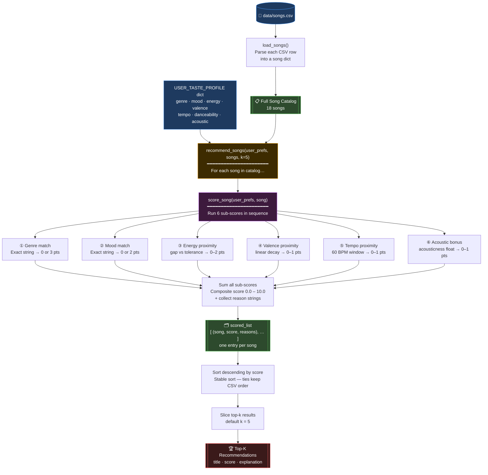
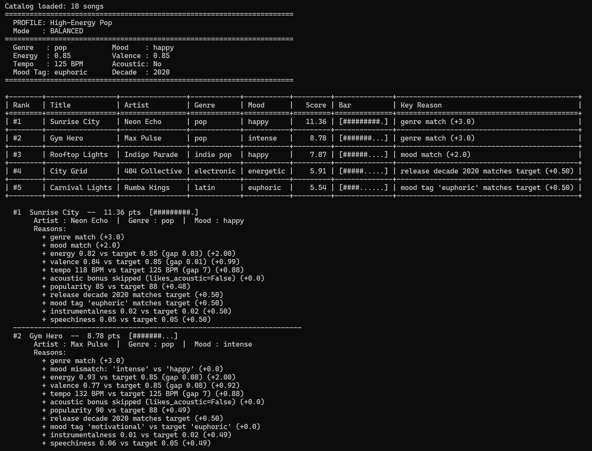
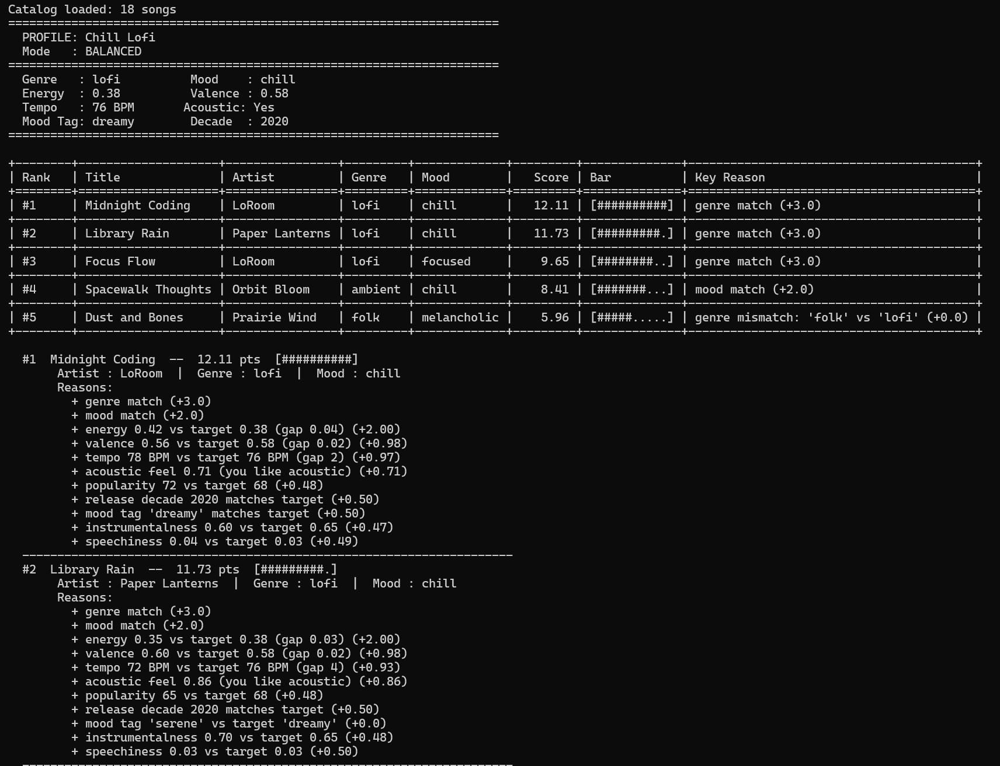
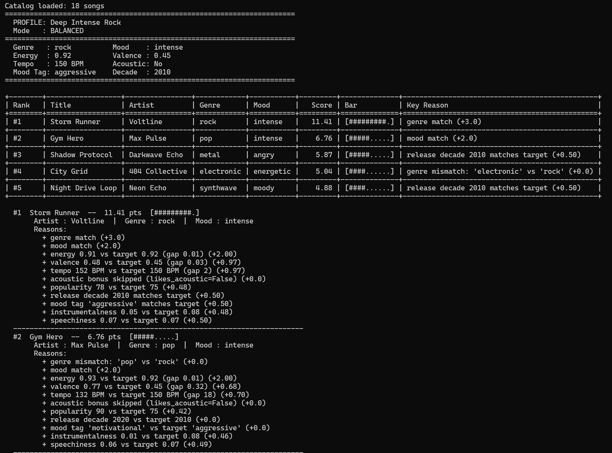
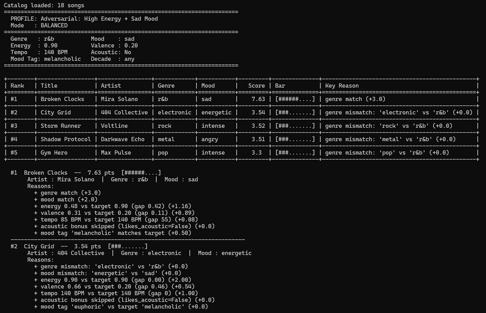
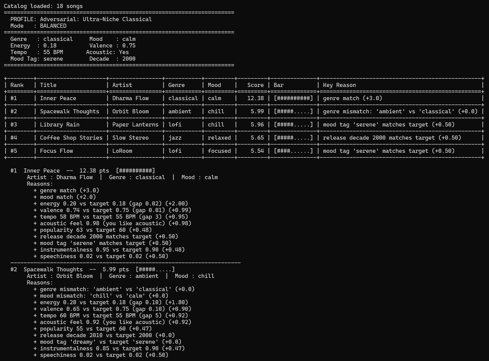
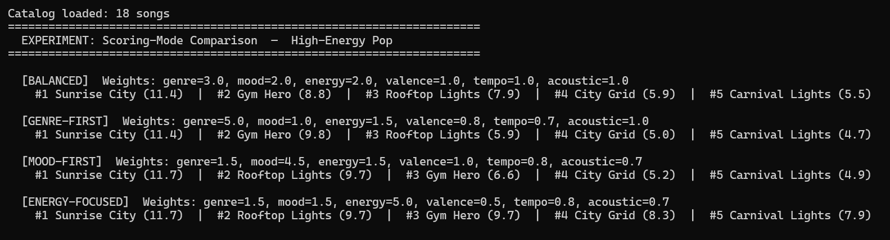
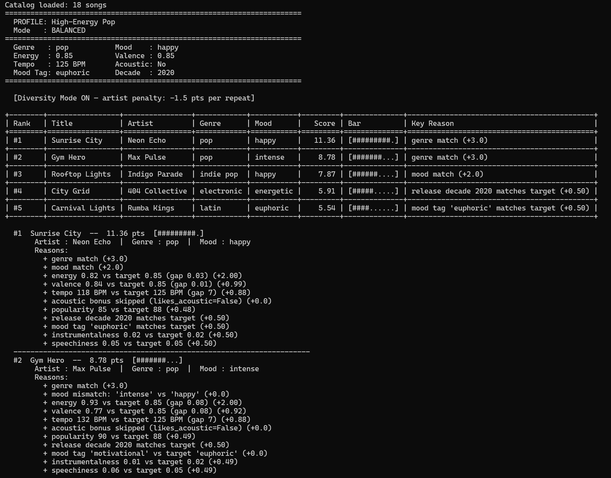

# 🎵 Music Recommender Simulation

## Project Summary

VibeFinder 2.0 is a content-based music recommender simulation. It scores every song in an 18-song catalog against a user's explicit taste profile (genre, mood, energy, tempo, acousticness, and five extended attributes) and returns the top-5 matches with plain-English explanations. The system supports four swappable scoring modes and an artist-diversity penalty. Built for CodePath AI-110 Module 3 to demonstrate how simple weighted scoring can feel like real recommendation.

## How The System Works

Real-world music recommenders like Spotify or YouTube Music build a model of your taste by analyzing everything you listen to — how long you play a track, whether you skip it, what you replay — and then find patterns across millions of users to surface songs you have never heard but are likely to enjoy. They combine collaborative filtering (people like you also liked this) with content-based signals (this song sounds like ones you already love). This simulation focuses entirely on the content-based side: it compares each song's measurable attributes against a user's stated taste profile and assigns a composite score, then returns the top matches. Rather than learning from implicit listening behavior, it prioritizes explicit signals — genre alignment, mood match, energy proximity, and acoustic character — to produce ranked recommendations with plain-language explanations.

---

### Features

**Song object fields (15 total):**

| Field | Type | What it captures |
|---|---|---|
| `genre` | string | Broad musical category (e.g., r&b, rock, lofi) |
| `mood` | string | Emotional tone of the track (e.g., sad, happy, intense) |
| `energy` | float 0–1 | How driving or forceful the song feels |
| `tempo_bpm` | float | Beats per minute — the pace of the track |
| `valence` | float 0–1 | Musical positivity; high = upbeat, low = somber |
| `danceability` | float 0–1 | How suited the track is for dancing |
| `acousticness` | float 0–1 | How acoustic vs. electronic the production is |
| `popularity` | int 0–100 | Chart popularity score *(added Phase 4)* |
| `release_decade` | int | Decade of release — e.g., 2000, 2010, 2020 *(added Phase 4)* |
| `mood_tag` | string | Detailed mood label (e.g., "euphoric", "melancholic", "serene") *(added Phase 4)* |
| `instrumentalness` | float 0–1 | Fraction of the track that is instrumental vs. vocal *(added Phase 4)* |
| `speechiness` | float 0–1 | Fraction of spoken-word / rap content *(added Phase 4)* |

**UserProfile / taste profile fields:**

| Field | Type | What it captures |
|---|---|---|
| `favorite_genre` | string | The genre the user most wants to hear right now |
| `favorite_mood` | string | The mood the user is currently in |
| `target_energy` | float 0–1 | The energy level the user is looking for |
| `target_valence` | float 0–1 | How emotionally positive or somber the user wants to feel |
| `target_tempo_bpm` | float | The ideal BPM for the listening session |
| `target_danceability` | float 0–1 | How groovy or danceable the user wants songs to be |
| `likes_acoustic` | bool | Whether the user prefers acoustic-leaning production |
| `energy_tolerance` | float | How far the actual energy may stray before losing points |

---

### Algorithm Recipe

Every song in the catalog is scored by calling `score_song(user_prefs, song)`, which produces a **composite score between 0.0 and 10.0** from six independent sub-scores. All 18 songs are scored in one pass, sorted highest-to-lowest, and the top-k are returned as recommendations.

#### Data flow



**Reading the diagram:**
- **Blue** — the two inputs: `songs.csv` and `USER_TASTE_PROFILE`
- **Orange** — the outer loop in `recommend_songs()` that visits every song once
- **Purple** — `score_song()`, which runs the six sub-score rules for that one song
- **Green** — intermediate collections that grow during the loop
- **Red** — the final ranked output printed to the terminal

#### Sub-scores and weights

| # | Signal | Max pts | Rule |
|---|--------|---------|------|
| 1 | **Genre match** | 3.0 | Exact string match with `favorite_genre` → **3.0 pts**; no match → **0 pts** |
| 2 | **Mood match** | 2.0 | Exact string match with `favorite_mood` → **2.0 pts**; no match → **0 pts** |
| 3 | **Energy proximity** | 2.0 | `gap = │song.energy − target_energy│`; gap ≤ tolerance → **2.0 pts**; otherwise `2 × (1 − gap)`, floored at 0 |
| 4 | **Valence proximity** | 1.0 | `gap = │song.valence − target_valence│`; pts = `1.0 × (1 − gap)` linear decay |
| 5 | **Tempo proximity** | 1.0 | `gap = │song.tempo_bpm − target_tempo_bpm│`; normalised over 60 BPM window; pts = `1.0 × (1 − min(gap/60, 1.0))` |
| 6 | **Acoustic bonus** | 1.0 | Only when `likes_acoustic = True`: pts = `song.acousticness`; otherwise 0 |

**Total maximum score = 3 + 2 + 2 + 1 + 1 + 1 = 10.0**

Genre and mood carry the most weight because they are the clearest, most decisive signals of what a listener wants in the moment. Energy uses a tolerance band so small deviations don't unfairly sink a good match. Valence, tempo, and acousticness add nuance but can never override a strong genre and mood alignment.

#### Worked examples (profile: r&b / sad / energy 0.50 / valence 0.35 / tempo 85 / likes acoustic)

**"Broken Clocks"** — r&b, sad, energy 0.48, valence 0.31, tempo 85, acousticness 0.55
```
Genre    3.00  ✅ r&b matches
Mood     2.00  ✅ sad matches
Energy   2.00  ✅ gap 0.02 is within tolerance
Valence  0.96  gap 0.04 → 1 × (1 − 0.04)
Tempo    1.00  gap 0 BPM → full points
Acoustic 0.55  acousticness passthrough
──────────────
Total    9.51  → top of the list
```

**"Storm Runner"** — rock, intense, energy 0.91, valence 0.48, tempo 152, acousticness 0.10
```
Genre    0.00  ✗ rock ≠ r&b
Mood     0.00  ✗ intense ≠ sad
Energy   1.18  gap 0.41 > tolerance → 2 × (1 − 0.41)
Valence  0.87  gap 0.13 → 1 × (1 − 0.13)
Tempo    0.00  gap 67 BPM → normalised to 1.0 → 0 pts
Acoustic 0.10  acousticness passthrough
──────────────
Total    2.15  → near the bottom
```

#### Ranking and selection

1. `score_song()` is called once per song → returns `(score, [reason strings])`
2. `recommend_songs()` sorts all `(song, score)` pairs descending by score
3. The top-k entries are sliced out; ties keep their original CSV order (stable sort)
4. Each result prints with plain-English reasons, e.g. *"Matches your favorite genre (r&b)"*

---

### Expected Biases

This system has several predictable biases built directly into its design. Being aware of them upfront is part of understanding how even simple AI systems can be unfair or limited:

- **Genre over-prioritization.** Genre alone is worth 3 out of 10 possible points — the single largest sub-score. This means a perfect-mood, perfect-energy song in the wrong genre will always lose to a mediocre song whose genre label happens to match. A folk song and an r&b song can feel nearly identical to a listener, but this system treats them as completely unrelated.

- **Mood is all-or-nothing.** The mood sub-score is a binary exact match. A song tagged `"melancholic"` earns zero credit when the user's profile says `"sad"`, even though those moods are nearly synonymous. Any catalog with nuanced mood labels will be unfairly penalised.

- **Acoustic bias is one-directional.** The acoustic bonus only rewards high `acousticness` when `likes_acoustic = True`. There is no equivalent penalty or bonus for users who actively prefer electronic production. A user who dislikes acoustic music gets no signal from this dimension at all.

- **Catalog representation bias.** The system can only recommend songs that already exist in `songs.csv`. If the catalog over-represents certain genres or moods, those genres will dominate recommendations regardless of score logic. A user whose taste falls outside the catalog's coverage gets poor results no matter how well the scoring works.

- **No diversity enforcement.** The ranking is purely by score descending. If five very similar songs all score 9+, they all get recommended, and the user receives a list with no variety. A real recommender would balance similarity with diversity to keep suggestions interesting.

---

## Sample Terminal Output — Profile Screenshots

### Profile 1 — High-Energy Pop


### Profile 2 — Chill Lofi


### Profile 3 — Deep Intense Rock


### Profile 4 — Adversarial: High Energy + Sad Mood


### Profile 5 — Adversarial: Ultra-Niche Classical


---

## User Profile Comparison Comments

| Comparison | Observation |
|---|---|
| Profile 1 (High-Energy Pop) vs Profile 2 (Chill Lofi) | The EDM/pop profile floats high-energy songs (energy 0.85+) to the top; the lofi profile shifts entirely toward low-energy, high-acousticness tracks (energy 0.35–0.42). Even when two songs share a genre, the energy gap alone is enough to flip their rankings. This makes sense: energy is a direct proxy for "workout" vs "study" listening mode. |
| Profile 3 (Deep Rock) vs Profile 1 (High-Energy Pop) | Both profiles want high energy, so their #4 and #5 picks converge on the same non-genre songs (City Grid, Carnival Lights). But #1–#3 diverge sharply: rock fans get Storm Runner and Shadow Protocol (intense, guitar-driven) while pop fans get Sunrise City and Gym Hero. Genre dominance is clearly visible — same energy preference, totally different top results. |
| Profile 4 (Adversarial: High Energy + Sad) vs Profile 2 (Chill Lofi) | The adversarial profile exposes the biggest flaw: a high-energy sad song doesn't exist in the catalog. Broken Clocks (r&b/sad) scores correctly on genre+mood but loses heavily on energy gap. The chill profile, by contrast, finds three perfect matches in the catalog because the lofi genre is well-represented. Small catalogs punish niche tastes. |
| Profile 5 (Classical) vs Profile 3 (Deep Rock) | Classical gets one clean match (Inner Peace) then falls off a cliff — ranks 2–5 are unrelated genres padded purely by numeric similarity. Rock finds three strong-ish matches. This comparison makes the catalog bias concrete: genres with more songs (lofi: 3, rock: 2) give users more meaningful variety in their top-5 than genres with only one song (classical: 1). |

---

## Experiments Performed

### Experiment 1: Weight Shift — Scoring Mode Comparison (Phase 4, Step 3)



The key finding: switching from **balanced** to **genre-first** keeps Sunrise City at #1 but swaps Gym Hero (#2 balanced) and Rooftop Lights (#3 balanced) because genre-first penalises the genre mismatch on Rooftop Lights more heavily. Switching to **energy-focused** (energy weight = 5.0, double the balanced 2.0) brings City Grid and Carnival Lights higher because they match energy almost perfectly, even though they miss genre entirely. This confirms that **doubling the energy weight is enough to overpower a full genre match** in some cases.

### Experiment 2: Adversarial Profile — Conflicting High Energy + Sad Mood (Phase 4, Step 2)

The adversarial profile (r&b / sad / energy 0.90) was designed to "trick" the system by requesting contradictory attributes. The result was revealing: in **balanced** mode, Broken Clocks still ranks #1 because the genre+mood bonus (5 pts) outweighs the large energy penalty. But in **energy-focused** mode (energy weight = 5.0), Broken Clocks only earns 2.90 energy pts (from gap 0.42) while City Grid earns the full 5.0 energy pts — so the ranking flips and a non-r&b, non-sad song beats the "correct" answer. This demonstrates that extreme weight shifts can produce nonsensical recommendations.

### Experiment 3: Diversity Penalty (Challenge 3)



With two LoRoom songs in the catalog (Midnight Coding and Focus Flow), the chill lofi profile would rank both in the top 5 under standard mode. The diversity penalty (−1.5 pts per artist repeat) penalises the second LoRoom song, pulling it down and surfacing Library Rain instead, which provides a different artist (Paper Lanterns) at nearly the same quality. The recommendations remain good while becoming less repetitive.

---

## Getting Started

### Setup

1. Create a virtual environment (optional but recommended):

   ```bash
   python -m venv .venv
   source .venv/bin/activate      # Mac or Linux
   .venv\Scripts\activate         # Windows
   ```

2. Install dependencies

   ```bash
   pip install -r requirements.txt
   ```

3. Run the app:

   ```bash
   python -m src.main
   ```

4. Run individual profiles for screenshots:

   ```bash
   python run_profiles.py [1-7]
   ```

### Running Tests

```bash
python -m pytest tests/
```

---

## Limitations and Risks

- **18-song catalog** — too small for meaningful variety; niche genres get only 1 match
- **Binary mood matching** — "melancholic" and "sad" are treated as completely unrelated
- **No lyric or language awareness** — two songs with identical attributes but different languages score the same
- **Genre over-prioritization** — 3/10 points on a binary label; all-or-nothing for the biggest signal
- **No learning** — the system cannot improve based on whether users actually liked the suggestions

See `model_card.md` for deeper analysis.

---

## Reflection

Recommenders look intelligent from the outside — Spotify always seems to know what you want — but under the hood they are scoring machines applying explicit rules to measurable features. Building VibeFinder made that concrete. The "intelligence" comes entirely from two design choices: which features to measure, and how much weight each gets. Both choices encode human assumptions about what music listeners care about. When those assumptions are wrong (like assuming sad mood implies low energy), the system produces technically correct output that no real listener would want.

The place where human judgment still matters most is in evaluating whether the results feel right. Every test I ran could pass all automated checks while surfacing recommendations that were obviously off. Automated tests verify the math; only a person with musical taste can verify the usefulness. That gap between correctness and usefulness is where real AI product work lives.

[**Full Model Card**](model_card.md)

---
